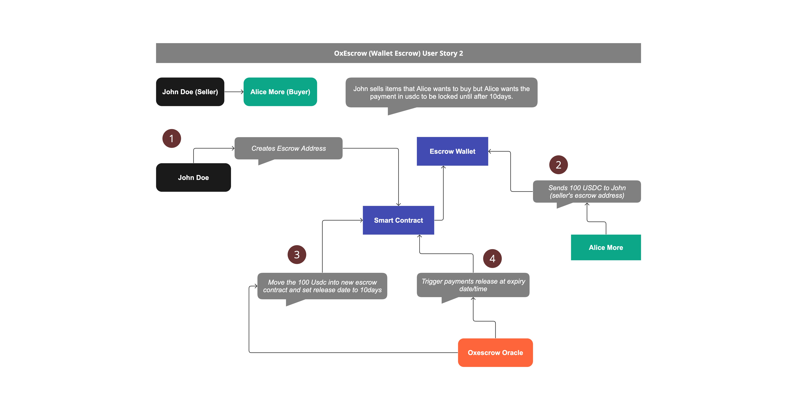

# OxEscrow Payment Processor
Oxescrow is a payment processor that allows people send and receive 
USDC trustlessly on the solana network.

The Oxescrow provides a slick and easy to use interface that lets users perform transactions on the platform as well as track payments and ongoing escrow transactions.

With the Oxescrow someone offering a goods or service online can recieve payments from their respective clients and visiting the platform, creating an escrow wallet account and send to their clients to make payments. Once usdc is deposited into that wallet it then gets converted into an escrow between the depositor and the initializer of the wallet.

The steps are as follows 
- Seller visit the website and generate an escrow wallet account that can receive usdc
- Buyer sends usdc to the account
- The escrow platform auto release the usdc to the seller at the expiry date

#### Oxescrow User Story
